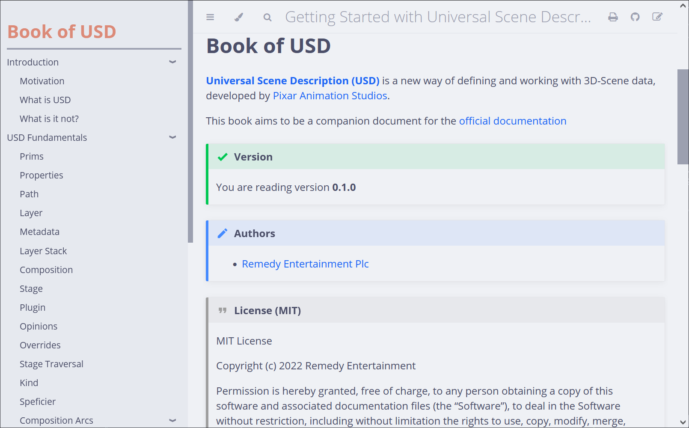

# Universal Scene Description (USD) for Beginners

This book aims to offer a more human-readable and artist friendly way of learning Universal Scene Description (USD) and its jargon. It is not a replacement of the [official USD Glossary](https://graphics.pixar.com/usd/release/glossary.html), but more of a starting point for anyone new to the technology.

## Install rust language and mdbook + mdbook-admonish

- Follow the instructions on https://www.rust-lang.org/learn/get-started to install rust for your system
- Run `rustup update` to update rust to the latest version
- Run `cargo install mdbook mdbook-catppuccin mdbook-admonish` to install [`mdbook`](https://rust-lang.github.io/mdBook/), [mdbook-catppuccin](https://github.com/catppuccin/mdbook) and [`mdbook-admonish`](https://github.com/tommilligan/mdbook-admonish)

## Building
Building is as simple as 
`mdbook build -d <PATH TO OUTPUT_FOLDER>`

Be sure to also run `mdbook clean -d <PATH TO OUTPUT FOLDER>` once in a while

## Previewing
You can also preview the book via `mdbook serve --open` to automatically compile and preview the book in your web browser
