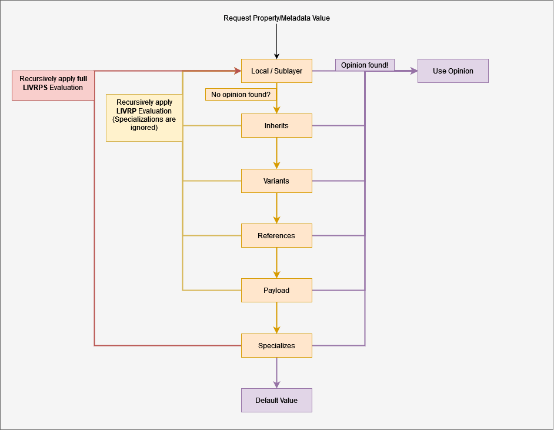

# Strength Ordering (LIVRPS)

Composition and opinion value resolution go hand in hand, and in order to remain sane; there are rules. Each composition arc has a "strength" assigned to it. Meaning that if for example opinions targeting a property are authored on 3 different composition arcs within the same layer stack, the composition arc that is the "strongest" wins. This is where the acrynonym `LIVRPS (Liver Peas)` comes into play.   

It stands for
- `L`ocal
- `I`nherits
- `V`ariants
- `R`eferences
- `P`ayloads
- `S`pecializes

This list acts as top-down stack. When USD needs to resolve an opinion for a property or metadatum, it will look for opinions via these composition arcs in this exact order. If an opinion has been found, any subsequent searches down the stack are immediately aborted and the opinion is resolved. If no authored opinion has been found, USD will fall back to the property/metadatum's default value.

All composition arcs besides Local will trigger a recursive LIVRP(S) evaluation. However, within this recursive evaluation, `S`(pecializes) is ignored except for the [Specializes](../intermediate/specializes.md) composition arc. It triggers a full `LIVRPS` evaluation if encountered.

The following diagram visualizes the decision tree of when and where opinion values are fetched



---

```admonish note title=""
↪ [USD Glossary - LIVRPS Strength Ordering](https://graphics.pixar.com/usd/release/glossary.html#usdglossary-livrps-strength-ordering)
```