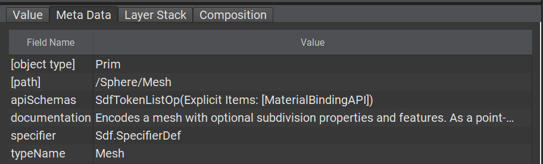
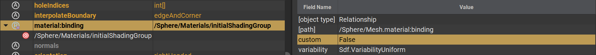

# API Schemas

API Schemas offer a way to contribute to a prim's "definition" by defining sets of predefined properties and metadata or offer a way to extract that information for you.

Generally speaking, API Schemas come in two different flavors, `Non-applied API Schemas` and `Single or Multiple-applied API Schemas`.

## Non-Applied Schemas
These schemas helps the developer by offering a high level abstraction for fetching properties and metadata.

These kinds of schemas usually do not define properties themselves, only ways to fetch them.

```python
# Python example to set the Kind type on a prim via the UsdModelAPI, a non-applied API schema
Usd.ModelAPI(prim).SetKind(Kind.Tokens.subcomponent)
```

```admonish info title=""
Users will generally never have to deal with these as they can only really be used programmatically
```

## Single or Multiple-applied API Schemas

These are the kinds of schemas users will interact with implicitly.  
Applied API Schemas define the default properties that will be added to a prim's definition when it is applied.

For example if an applied schema (let's call it `FooAPI`) defines a `float` attribute named `foo`, when that schema is applied to a prim, the `foo` property will be available for users to express opinions on. If the user does not express an opinion on it, `foo` will fall back to its default value.  

In a more concrete example, let's look at the `MaterialBindingAPI` which is responsible for defining properties on prims that need a binding to a material.  
The prim at path `/Sphere/Mesh` has the `MaterialBindingAPI`  applied to it through the prim's apiSchemas metadata (this a [List-Editable](./list_editing.md) metadatum btw, so users can also override which API Schemas are applied to a prim)

```admonish example title="Applied Schemas"

```

This allows for editing the `material:binding` property on this prim now. The important thing to note here is the `custom` metadatum on the property. This indicates that the property is known to USD and that it belongs to a schema. Generally speaking, if `custom` is authored as True, it is considered an inert, out-of-schema property.

```admonish example title="Schema defined attribute"

```

---

```admonish note title=""
↪ [USD Glossary - API Schema](https://graphics.pixar.com/usd/release/glossary.html#api-schema)
```
