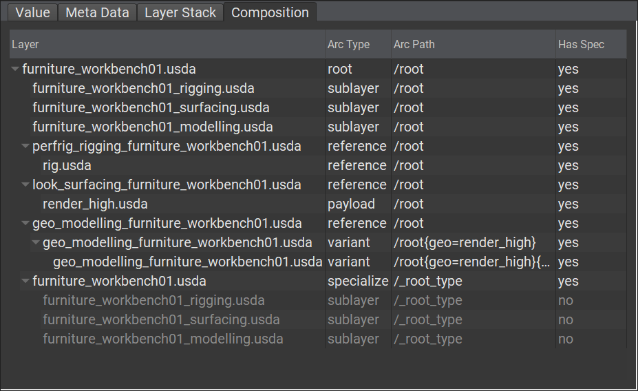

# Composition

Roughly put, the act of combining layers and their prims, properties and metadata together through various means known as composition arcs.

While combining layers together could be considered "composing" them, what USD's composition engine actually uses are the layer stacks of each layer.  

```admonish warning title=""
This is a very important distinction to make as targeting a layer stack also means that any composition within the target layer stack is also taken into account 
```

~~~admonish example title="composition of furniture_workbench01.usda's `/root` prim"


The example may look complex and confusing, but all it says is that the prim at path `/root` has contributions from all the layers (specifically, their Layer Stacks) listed.    
The `Arc Type` column indicates _how_ those layers contribute to the final "specification" of `/root` (more on that later).  

~~~

---

```admonish note title=""
↪ [USD Glossary - Composition](https://graphics.pixar.com/usd/release/glossary.html#usdglossary-composition)
```