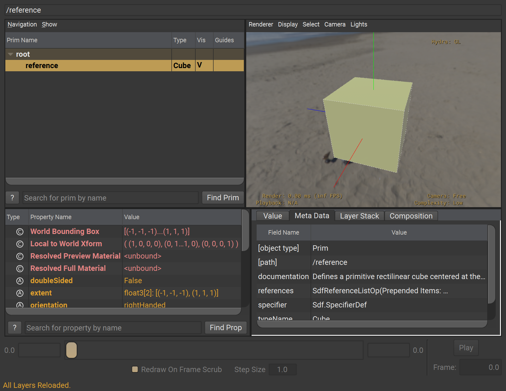
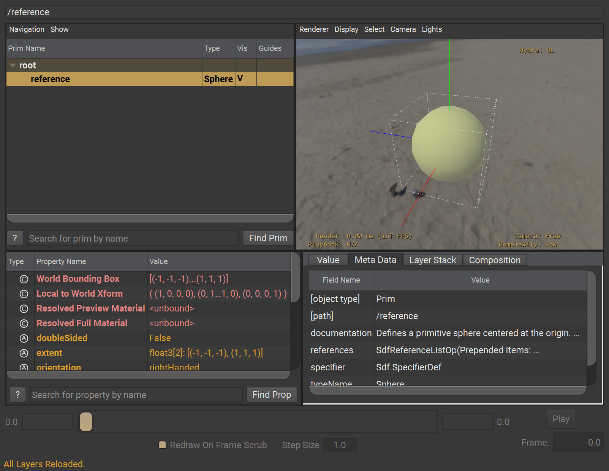
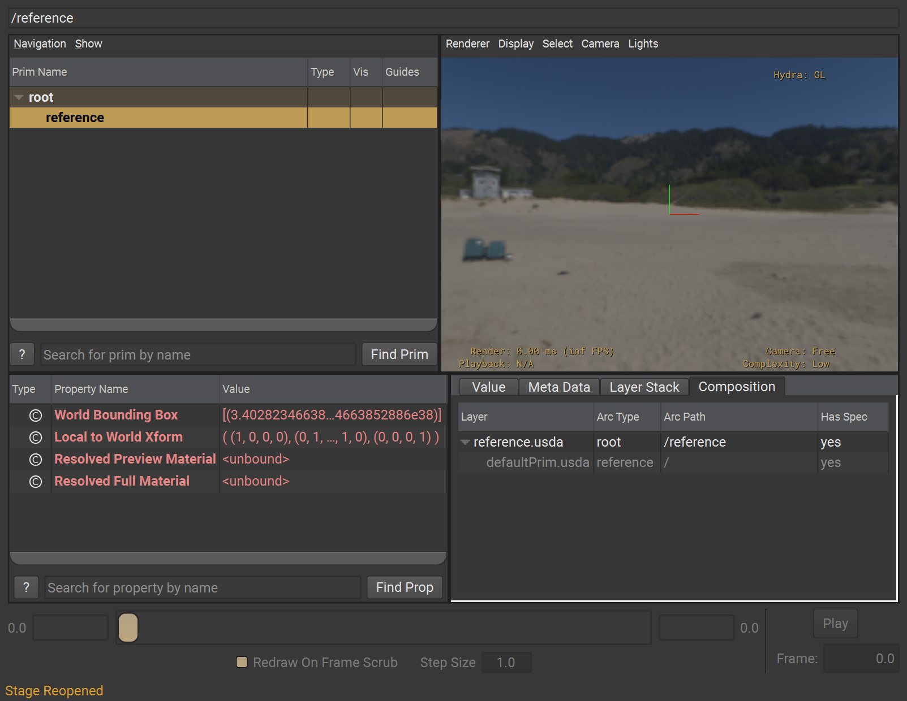

# Default Prim

When authoring a layer, it is possible to also define a "default prim" for it. This is a layer metadatum that contains the name of the prim that should be used automatically when using this layer in a reference or payload composition arc without an explicit prim path.  

The prim name indicates a root level prim, meaning a direct child of the `PseudoRoot`. Therefore, it is not allowed to point to a path.

```admonish example title ="example defaultPrim in layer metadata"
~~~
#usda 1.0
(
    defaultPrim = "PrimName"  
)
~~~
```

If `defaultPrim` has not been explicitly authored, USD will trigger a "unresolved reference prim path" warning and the target layer will not compose correctly.

```
Warning: ... In </reference>: Unresolved reference prim path @.../defaultPrim.usda@<defaultPrim> ...
```

```admonish tip title=""
**It is recommended to always specify `defaultPrim` inside layers.**
```

## Example
Let's take a look at a very simple example case. There are two layers, one that defines multiple prims at its root (`defaultPrim.usda`), and one that references it (`reference.usda`).

```admonish example title="defaultPrim.usda"
~~~
#usda 1.0
(
    defaultPrim = "CubePrim"  
)

def Cube "CubePrim" {}
def Sphere "SpherePrim" {}
def Cone "ConePrim" {}
~~~
```

Do note that `reference.usda` only references the layer itself and does not specify a particular prim to reference in from `defaultPrim.usda`
```admonish example title="reference.usda"
~~~
#usda 1.0

def "reference"(
    prepend references= @defaultPrim.usda@
) {
}
~~~
```

When opening the `reference.usda` layer inside a `usdview` stage, we see that only one prim is brought into its Layer Stack, and that is the `Cube`.

```admonish example title=""

```

When changing the default prim metadatum to for example `defaultPrim = "SpherePrim"`, the `Sphere` will now be referenced in instead.

```admonish example title=""

```

Removing the `defaultPrim` metadatum altogether will yield an empty reference arc. The layer itself is still referenced, but none of the prims in it are composed.

```admonish example title=""

```

---

```admonish error title=""
↪ No USD Glossary Entry!
```