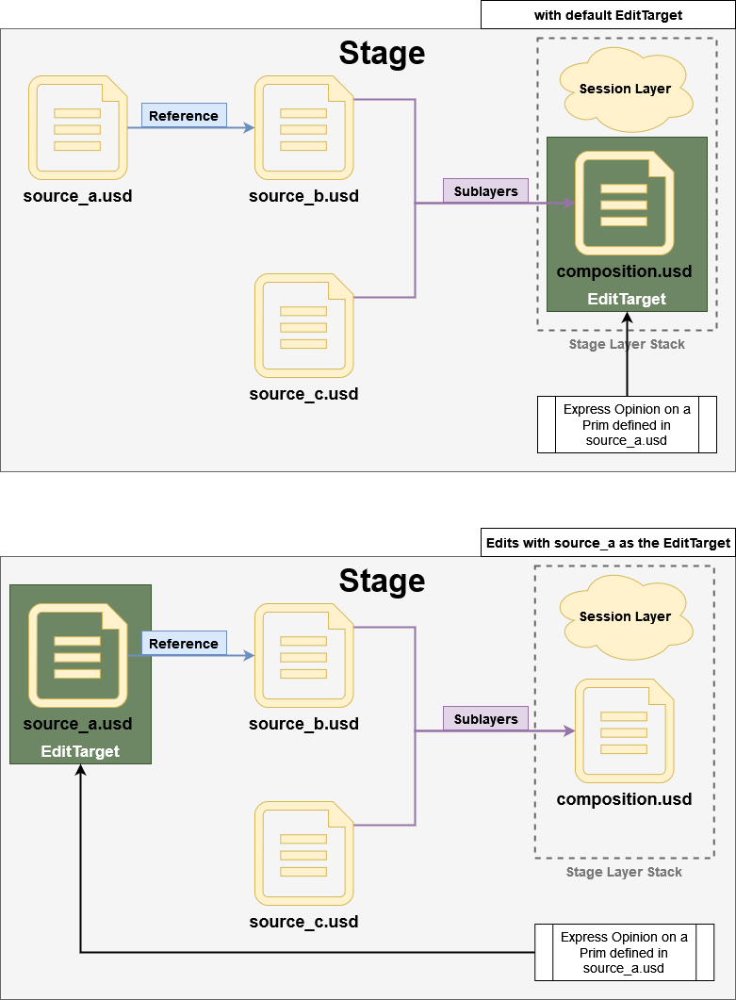

# EditTarget

When opening a layer in a stage, and you make edits to the scene graph, these edits are by default recorded onto the "Root Layer" (the layer used to create the stage).

In the scenario of a complex composition consisting out of many layers and composition arcs, it is not out of the ordinary to want to make edits to one of those layers. Rather than opening said layer individually and applying the edits there, USD offers something called an `EditTarget`. This `EditTarget` allows you, as the user, to specify to USD which _layer_ edits should get recorded to (edits being: overrides, hierarchy changes, etc...).

With this mechanism users can work in a fully composed scene, yet still be able to record edits to individual layers used in this composition. Think of it as changing the active layer in a Photoshop document.

```admonish tip title=""
This is a core workflow in USD
```


```admonish tip="Session Layers"
Usd by default also creates something called a "Session Layer" when creating a stage.  

This is a "scratch space" that can used as an EditTarget where users can record any edits without targeting any of the original layers.  

This Session Layer sits at the top of the stage's layer stack (stages also have layer stacks) and acts as any other layer in a layer stack. If set as an EditTarget, opinions expressed in this session layer are always the strongest.
```



---

```admonish note title=""
↪ [USD Glossary - EditTarget](https://graphics.pixar.com/usd/release/glossary.html#usdglossary-edittarget)
```