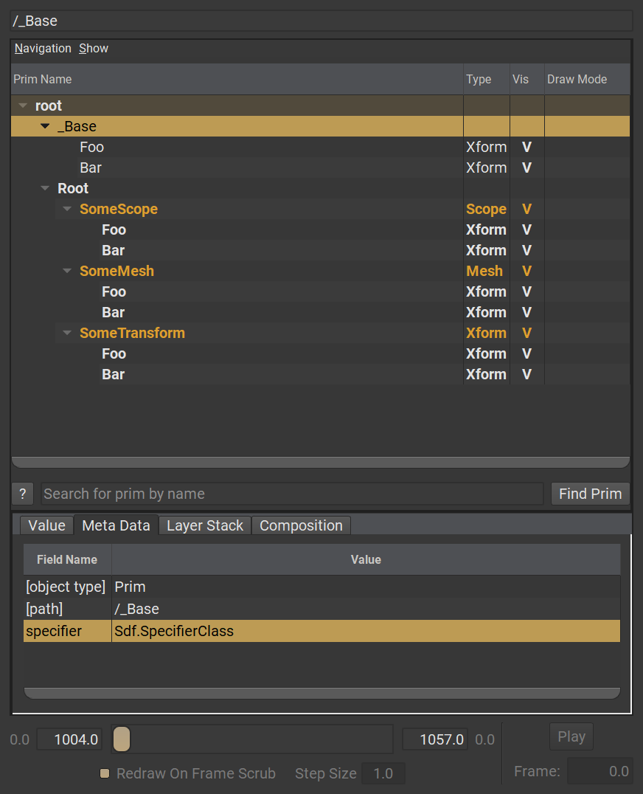
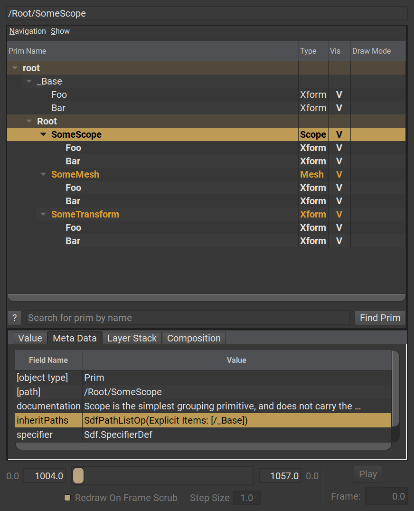
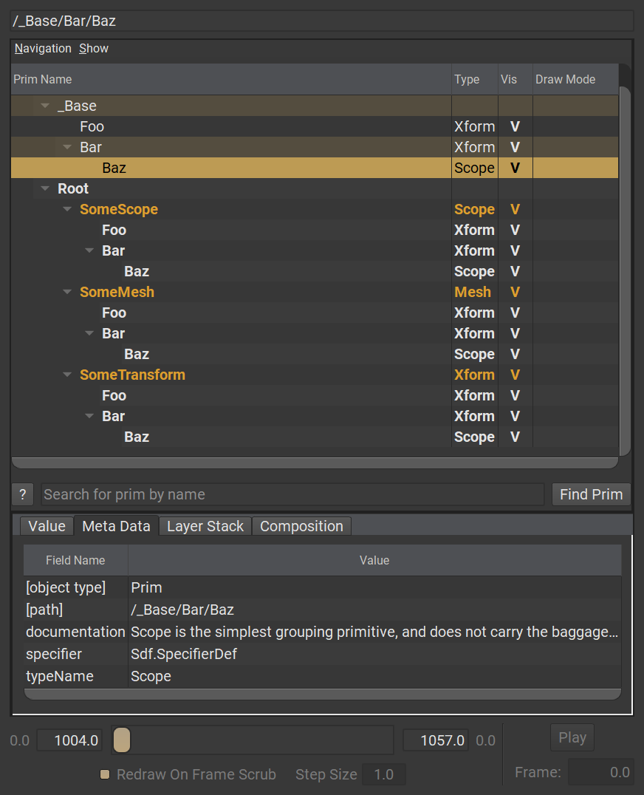

# Inherits

 Very similar to the concept of "inheritance" in programming. Prims can "inherit" other prims (concrete or abstract), meaning that they reflect the hierarchy and properties defined in the prim that they are inheriting from. This also means that if a change is authored on the base prim or its hierarchy, any prims that inherit it immediately get those changes applied to them.

Within context of a singular layer, inherits does not offer a noticeable difference between it and a local reference. However, when using inheritance in a multi-layer composition environment, it does differ. References tend to become fully encapsulated within the layer stack they're referenced. Meaning that references loose any sense of "connectivity" to their referred layers outside of their layer stack. Inherits on the other hand are always live, no matter how deeply nested within a composition, or how many redefinitions of its base. A prim is always able to backtrack to its original "base", regardless of composition depth!

```admonish warning title=""
Prims cannot inherit from an ancestor or descendant, inherit "bases" should be defined as siblings or outside of the target prim's hierarchy, for example at the root level
```

## Example → Simple inherits

`SomeScope`, `SomeMesh` and `SomeTransform` are defined prims of differing types, but all inherit from an abstract class prim named `_Base` . This class prim defines two Xform children, `Foo`  and `Bar`.  
Due to `_Base` being a class, it does not automatically show up in the hierarchy as class prims are not taken into account in default [Stage Traversal](./stage_traversal.md). So we have to explicitly tell `USDView` to also display `Abstract Prims`

~~~admonish example title="Definition of `_Base`"

~~~

Inheriting from `_Base` results in having its hierarchy grafted underneath each prim that inherits it.

```admonish example title="Simple inherits"

```

Modifying `_Base` would be reflected immediately on all prims that inherit from it, without having to do anything to these prims. In this case, a new child prim was added under `/_Base/Bar` called `Baz`

~~~admonish example title="Modified `_base`"

~~~

---

```admonish note title=""
↪ [USD Glossary - Inherits](https://graphics.pixar.com/usd/release/glossary.html#usdglossary-inherits)
```