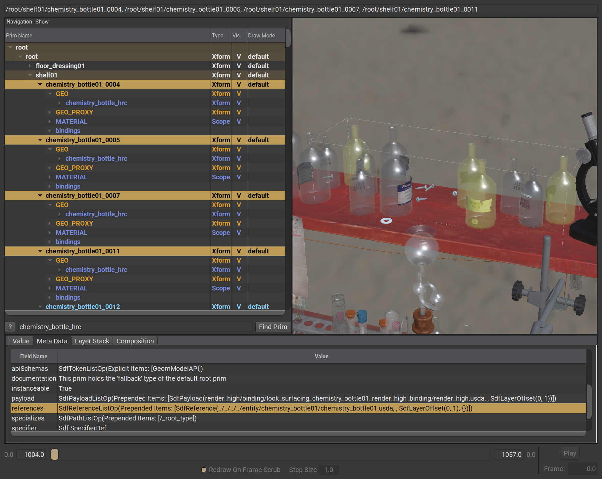
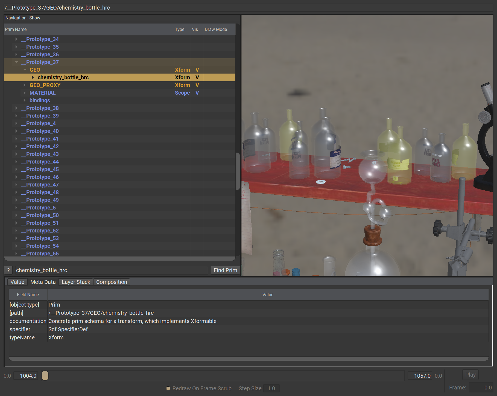

# Instancing

Instancing is a mechanism in USD where layers can be designed to save memory and composition complexity. 
When a layer is for example referenced onto a prim, USD will re-compose the entire hierarchy for each reference in that layer, even if all references point to the same layer. 

With instancing however, USD will create a "Prototype" of this reference's composed result behind the scenes, and every reference to this layer is replaced by a local-reference to this prototype prim instead. Enabling USD to compose the referenced layer's layer stack only once.

```admonish warning title=""
This concept does however come with a caveat, _overrides defined on prims underneath the prim that holds the reference are ignored_.
```

```admonish example title="Many bottles reference the same layer"

```

All selected prims in the example above reference `chemistry_bottle01.usda`, but are also marked as instanceable via the `instanceable = true` metadatum.
This metadatum tells USD that it should only compose the `chemistry_bottle01.usda` once in a `__Prototype` prim. When having done so, all references _internally_ to `chemistry_bottle01.usda` are actually local prim references to the prototype prim (in this case `__Prototype_37`).

```admonish example title="bottle prototype prim"

```

```admonish warning title=""
When a prim is marked as an instance, [Stage Traversal](../intermediate/stage_traversal.md) will also halt at this prim!
```

---

```admonish note title=""
↪ [USD Glossary - Instancing](https://graphics.pixar.com/usd/release/glossary.html#usdglossary-instancing)
```