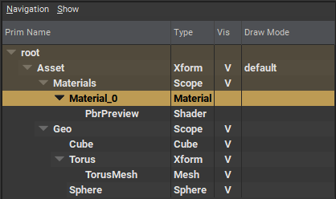

# IsA (Typed) Schema

"Is A prim this"-kind of schema. Essentially the schema definition that defines the "type" of prim.  

```admonish example title="Prim Type Schema"

```

In the image above, the `Type` column lists which `IsA Schema` the prim subscribes to.

When looking at the USD "code", the keyword between `def` and the name of the prim signifies which `IsA Schema` the prim should subscribe to.

```
def Xform "MyTransform" {}  # MyTransform subscribes to the Xform IsA Schema
def Cube "MyCube" {}  # MyCube subscribes to the Cube IsA Schema
def "EmptySpec" {}  # EmptySpec is a valid prim, it simply has no default set of properties attached to it. It could literally be anything.
```

```admonish warning title=""
Prims cannot subscribe to more than _1_ IsA schema!
```

## IsA Schema Example -> UsdGeomCube

In the example below you can see the schema definition for our favorite `Cube`. It defines that `Cube` inherits from `Gprim` (a base for all drawable prims), metadata for the type (like documentation string) and two attributes. `size` and `extent`.

~~~admonish example title="Cube schema definition"
```
class Cube "Cube" (
    inherits = </Gprim>
    doc = """Defines a primitive rectilinear cube centered at the origin.
    
    The fallback values for Cube, Sphere, Cone, and Cylinder are set so that
    they all pack into the same volume/bounds."""
    customData = {
        dictionary extraPlugInfo = {
            bool implementsComputeExtent = true
        }
    }
) {
    double size = 2.0 (
        doc = """Indicates the length of each edge of the cube.  If you
        author \\em size you must also author \\em extent.
        
        \\sa GetExtentAttr()"""
    )

    float3[] extent = [(-1.0, -1.0, -1.0), (1.0, 1.0, 1.0)] (
        doc = """Extent is re-defined on Cube only to provide a fallback value.
        \\sa UsdGeomGprim::GetExtentAttr()."""
    )

}
```
~~~

Creating new prim types can be as easy as the above, or as complex as defining an entire `Mesh`.

---

```admonish note title=""
↪ [USD Glossary - IsA Schema](https://graphics.pixar.com/usd/release/glossary.html#isa-schema)
```
