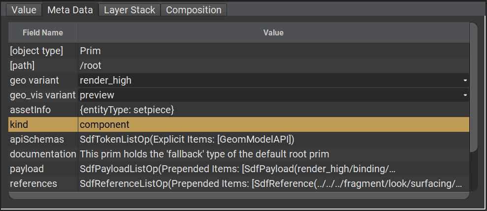
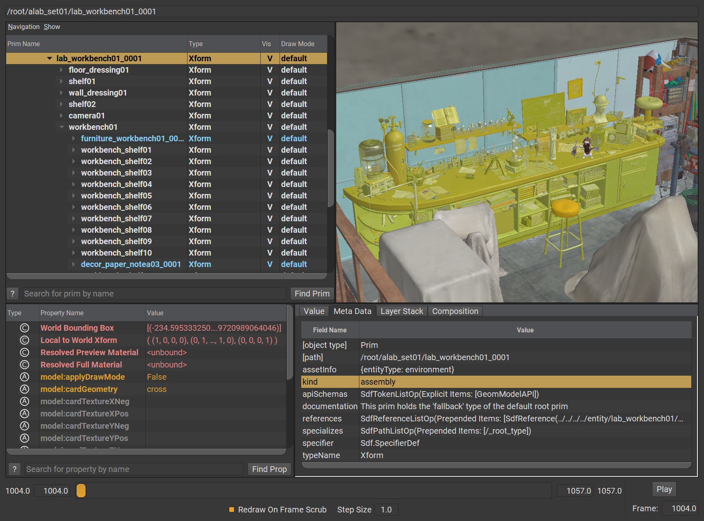
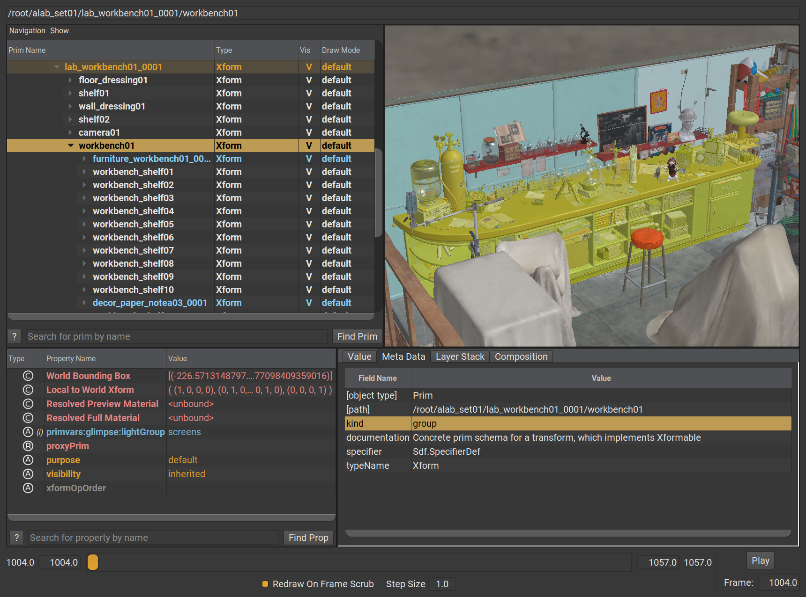
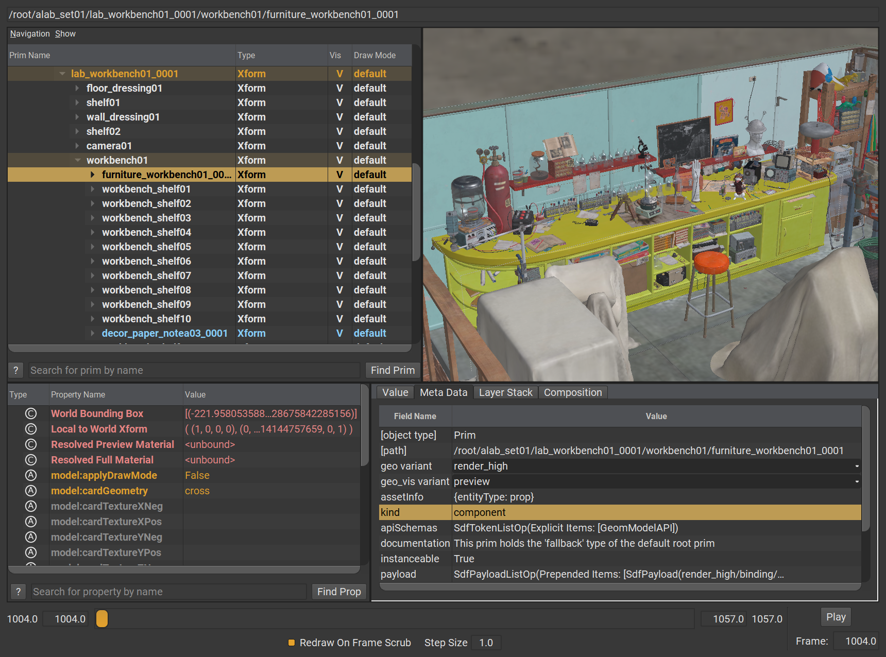

# Kind

_Kind_ is a prim-level metadatum that can be used to "categorize" prims and their descendants into higher level concepts than just their definitions (ex. `Mesh`, `Sphere`, `Cube`, etc...).

```admonish example title="Example Applied Kind"

```

USD ships with a few different `kind`s that can be used to categorize prims

| Kind Name         | What it does     |
|--------------|-----------|
| **model** | base class for all model kinds. `model` is considered an abstract type and should not be assigned as any prim’s kind|
| **group** | models that simply group other models|
| **assembly** | an important group model, often a published asset or reference to a published asset|
| **component** | a "leaf model" that can contain no other models|
| **subcomponent** | an identified, important "sub part" of a component model|

```admonish tip title=""
You can add new `kind` types via USD Plugins!
```


Using kind can greatly speed up finding the "right" types of prims you may be interested in during Stage Traversal. Kind annotations can be used to selectively prune entire prim child-trees for instance.


## How kind can be used

Taking a look at the root layer of [Animal Logic ALab](https://animallogic.com/alab/), we can see that top-level prims can be annotated as `assembly`, this allows for easily identifiying "assets" within the scene. In the example below, both `lab_workbench01_0001` and its parent `alab_set01` are annotated as assemblies.

```admonish example title="lab_workbench01_0001"

```

An `assembly` annotated prim by itself can contain other prims with varying types of `kind`s. Looking deeper in the example above, we can see that the workbench itself at `/root/alab_set01/lab_workbench01_0001/workbench01` is marked as a `group`.

```admonish example title="workbench01"

```

And diving even deeper, `/root/alab_set01/lab_workbench01_0001/workbench01/furniture_workbench01_0001` is a `component`. Component should not contain any other `kind` types that derive from `model`, but it can have `subcomponent` kinds.

```admonish example title="furniture_workbench01_0001"

```

These `component`s can then be used for efficient discovery and instancing without having the need to dive deeper into their own hierarchies.

```admonish note title=""
Production environments differ, so one studio's idea of an `asset` may differ from another, but the idea of `kind` based categorization is incredibly valuable
```

---

```admonish note title=""
↪ [USD Glossary - Kind](https://graphics.pixar.com/usd/release/glossary.html#usdglossary-kind)
```