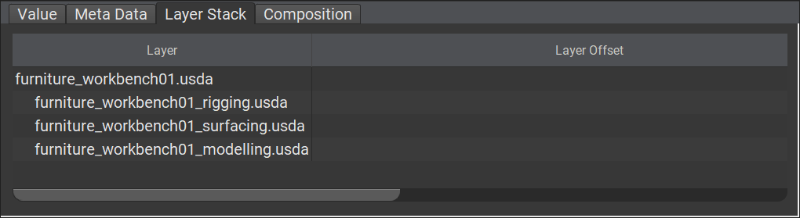

# Layer Stack

Each layer internally keeps track of a "local" stack of layers that contribute to that layer. This stack is an ordered collection of layers used within this layer that contribute to its hierarchy and [composition](./composition.md).

```admonish example title="furniture_workbench01.usda layer stack"


In the above, the layer `furniture_workbench01.usda` is made out of three other layers and itself. It adds the layers, `furniture_workbench01_modelling.usda`, `furniture_workbench01_surfacing.usda` and `furniture_workbench01_rigging.usda` in that order to its layer stack. Visually this order will look reversed as it is a stack after all, but the higher on the stack, the more "important" a layer is.
```

```admonish info title=""
A layer's Layer Stack always has its own data at the top of the stack, making itself the most important.
```

---

```admonish note title=""
↪ [USD Glossary - LayerStack](https://graphics.pixar.com/usd/release/glossary.html#usdglossary-layerstack)
```