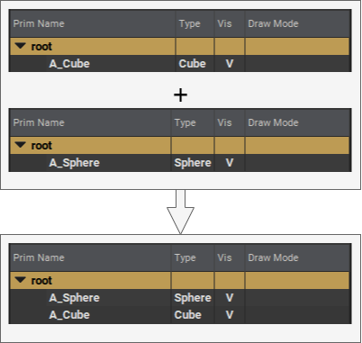

# Local/Sublayer

Layers can sublayer other layers, grafting multiple layer stacks together in order into one. Sublayering is in fact how Layer Stacks are made!

```admonish danger title=""
_Order matters_ when sublayering.  
```

To emphasize how order matters, given a `Cube` prim at path `/Foo` in `layer_a.usd` and a `Sphere` prim at path `/Foo` in `layer_b.usd`; when sublayering both in `layer_c.usd`, the final type of `/Foo` will depend solely on the _order_ in which `layer_a.usd` and `layer_b.usd` are brought in.

```admonish example title="Simple Sublayering Example"
Below we have three layers, `a_cube.usd`, `a_sphere.usd` and `cube_and_sphere.usd`

`a_cube` and `a_sphere` define a Cube and Sphere prim respectively. `cube_and_sphere` does not define either but sublayers both previous layers, essentially combining the two hierarchies into one defined in `cube_and_sphere`'s layer stack.


```

```admonish warning title=""
Sublayering grafts layers together at their roots! If you wish to combine layers at different levels of a hierarchy, use the [reference](./reference.md) composition arc
```

---

```admonish note title=""
↪ [USD Glossary - SubLayers](https://graphics.pixar.com/usd/release/glossary.html#usdglossary-sublayers)
```