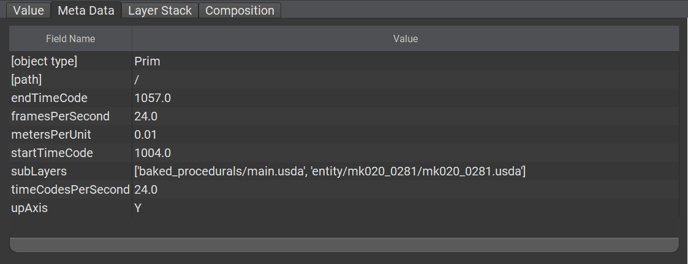
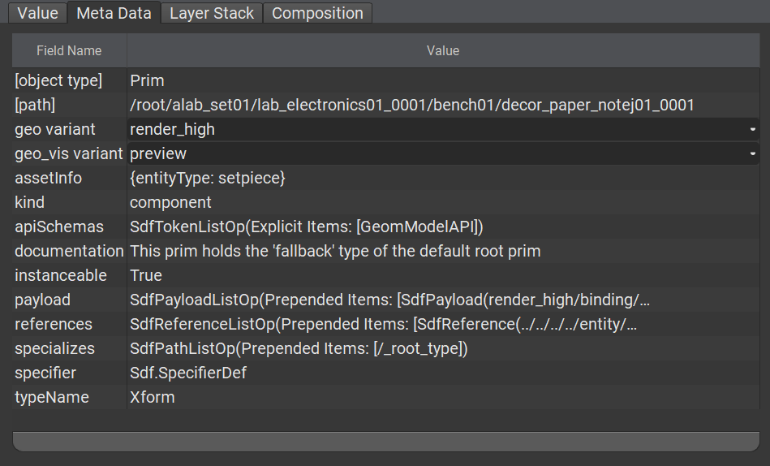
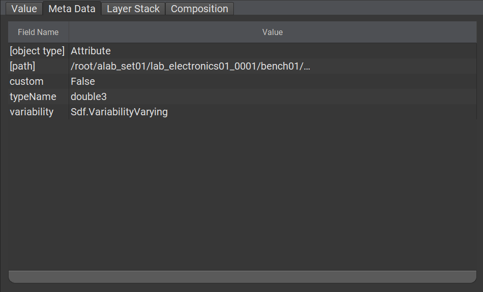

# Metadata

Prims, their properties, the layers they are part of and even the scene itself can have metadata applied to them. This is additional _static_ (as in, it can not change over time) data that USD or a user can read, use or define.

Metadata can be used to describe behavior, incur meaning, represent documentation, etc. USD comes bundled with an extensive suite of metadata out of the box.

```admonish tip title=""
Developers can define new metadata via USD Plugins!
```

## Simple Metadata Examples

### Layer Metadata
As mentioned above, layers can contain metadata.

```admonish example title=""

```

In the image above, the [PseudoRoot](https://graphics.pixar.com/usd/release/glossary.html#usdglossary-pseudoroot) at path `/` has been selected in `usdview`, this represents the composed state of the scene and has metadata inferring the following information to the user:
- The scene is in `centimeters` → `metersPerUnit = 0.01`
- The world up axis is `Y`
- Two layers contribute to the scene (more on that in a later chapter)
- Animation is present at a certain rate per second → `startTimeCode = 1004.0`, `endTimeCode = 1057.0`, `framesPerSecond = 24.0`, `timeCodesPerSecond = 24.0`

```admonish warning title=""
Do note that while a lot of metadata is _informative_, a large part of the core metadata suite also contributes to how USD works internally.

For example, `metersPerUnit` is purely informative, whereas `subLayers` has profound effects when changed!
```

```admonish note title=""
Other parts of USD like `UsdPhysics` define other layer metadata such as mass scaling in the form of `kilogramsPerUnit`
```

### Prim Metadata

TODO: TEXT AND IMAGE UPDATE

```admonish example title=""

```

```admonish abstract title=""
See the [Kind](./kind.md) chapter for an elaborate example on the `kind` metadatum can be used.
```

### Property Metadata

TODO: TEXT

```admonish example title=""

```

---

```admonish note title=""
↪ [USD Glossary - Metadata](https://graphics.pixar.com/usd/release/glossary.html#usdglossary-metadata)
```