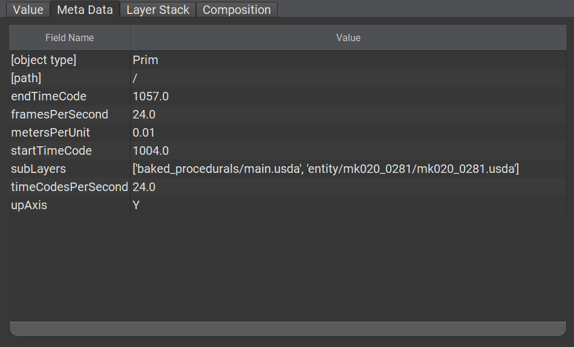

# Metadata

Prims, their properties and the layers they are part of can have metadata applied to them. This is additional _static_ (as in, it can not change over time) data that USD or a user can read, use or define.

Metadata can be used to describe behavior, incur meaning, represent documentation, etc. USD comes bundled with an extensive suite of metadata out of the box.

```admonish tip title=""
Developers can define new metadata via USD Plugins!
```

## Simple Metadata Examples

### Layer Metadata

```admonish example title=""

```

In the image above, the [PseudoRoot](https://graphics.pixar.com/usd/release/glossary.html#usdglossary-pseudoroot) at path `/` has been selected and the metadata panel in `usdview` has been highlighted. This root represents the `entry.usda` layer from [Animal Logic ALab](https://animallogic.com/alab/). `entry.usda` defines metadata that can be inspected and presents the following information to the user about itself:
- The linear units used are `centimeters` → `metersPerUnit = 0.01`
- The scene's up axis is `Y` → `upAxis = Y`
- Two layers contribute to the scene (see [Local/Sublayer](./local_sublayer.md) later)
- Animation is present between time code `1004.0` and `1057.0` with `24.0` frames and time codes per second.
  - `startTimeCode = 1004.0`
  - `endTimeCode = 1057.0`
  - `framesPerSecond = 24.0`
  - `timeCodesPerSecond = 24.0`

```admonish warning title=""
Do note that while a lot of metadata is just informational data, a large part of the core metadata suite also has side effects that contribute to how USD works internally.

For example, `metersPerUnit` is purely informative, whereas `subLayers` has profound effects when edited!
```


```admonish note title=""
Other USD hosts like Autodesk Maya or Sidefx Houdini may choose to interpret and act on metadata where USD itself does not
```

### Prim Metadata

```admonish example title=""

```

Metadata on Prims can infer a lot of information about the prim itself, how it is used in the scene (aka [Composition](./composition.md)), what kind of properties it has, etc.

From the above we know that the prim at `/root/alab_set01/lab_electronics01_0001/bench01/decor_paper_notej01_0001` 

- Is an `Xform` → `typeName = Xform`
- It is instanced (more about [Instancing](./instancing.md) later) → `instanceable = true`
- Has two VariantSets (more about [VariantSets](./variantset.md) later) → `geo` and `geo_vis`
- Is categorized as a `component` (more about the [Kind](./kind.md) metadatum later) → `kind = component`
- Etc.

```admonish abstract title=""
See the [Kind](./kind.md) chapter for an elaborate example on the `kind` metadatum can be used.
```

### Property Metadata

Lastly, there is property metadata. This data is meant to give fine grained information about the property itself. For example

- What type it is → `typename = double3`
- Whether it can change over time → `variability = Sdf.VariabilityVarying`
- Is it a custom "out-of-schema" (see [Schemas](./schemas.md) later) property → `custom = false`

```admonish example title=""

```

---

```admonish note title=""
↪ [USD Glossary - Metadata](https://graphics.pixar.com/usd/release/glossary.html#usdglossary-metadata)
```