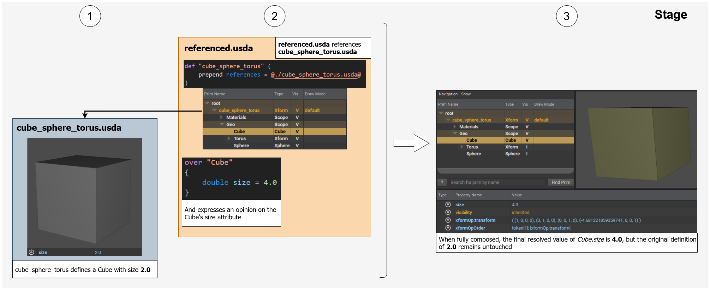

# Overrides


When expressing an opinion within a layer, it is possible to "redefine" a previously defined value of the property being edited. This mechanism is known as `overrides` because you are _overriding_ what was there before.
However, it is very important to note that the _original data_ remains unchanged. **The override only exists within the layer where you are defining it**

This is by far _the most important_ aspect to understand about USD. Opinions and their "value resolution" (resolving which value gets applied in the end) are key to the entire composition mechanism.

Below is a simple example of overriding a previously defined attribute's opinion.

```admonish example title="override example"
[](../images/terminology/overrides.png)

1. Shows `cube_sphere_torus.usda` where an attribute's [opinion] is first authored (`/GEO/Cube.size`)
2. Shows `referenced.usda` where
   * The layer `cube_sphere_torus.usda` is brought into the layer `referenced.usda` via a [composition] mechanism called `referencing`
   * An opinion is expressed on the already defined attribute `/GEO/Cube.size`, but in context of `cube_sphere_torus.usda`, essentially overriding what was there before
3. Shows the composed final result, aka the [stage]
```

[composition]: composition.md
[opinion]: opinions.md
[stage]: stage.md

---

```admonish note title=""
↪ [USD Glossary - Override](https://graphics.pixar.com/usd/release/glossary.html#usdglossary-override)
```
