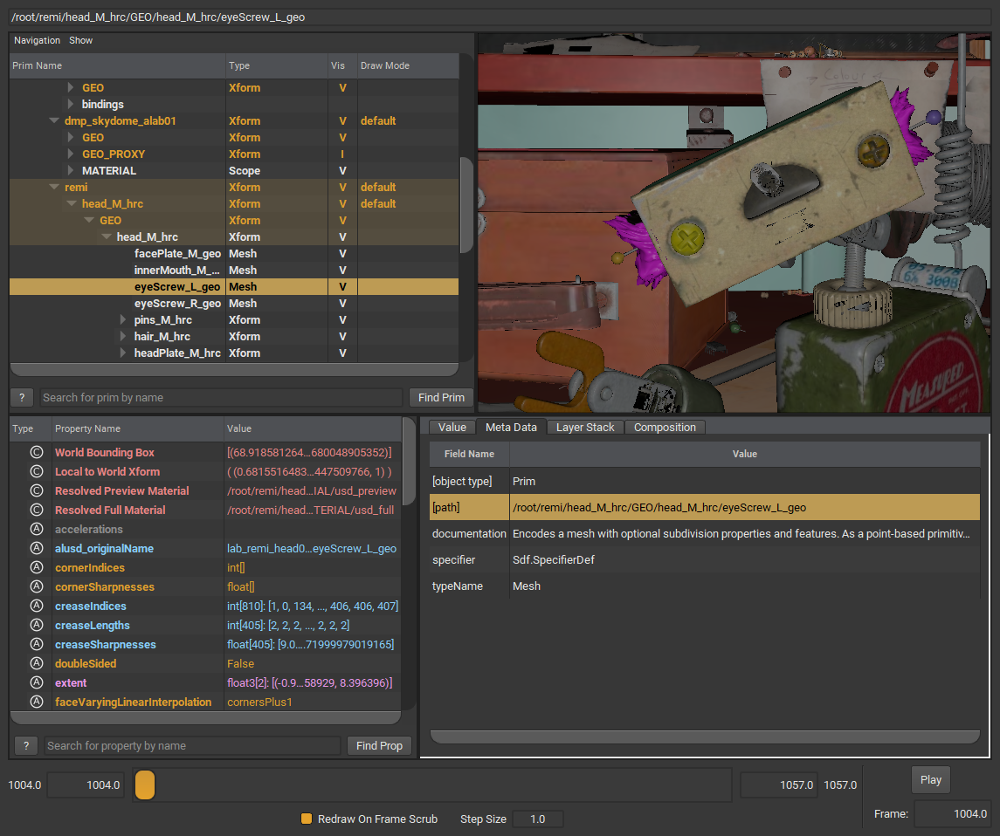
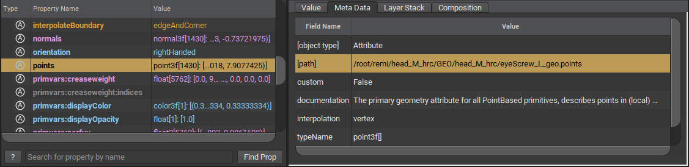

# Path

Prims and properties are identified by unique `paths` inside the scene hierarchy. They are a textual representation of a hierarchy - similar to folder paths in most operating systems - where each prim is separated from its parent or child via the `/` delimiter.

Just like folders, paths can be relative or absolute. Absolute paths always start with `/`

```admonish info title=""
`/` is a special path in USD. This is known as the [PseudoRoot](https://graphics.pixar.com/usd/release/glossary.html#usdglossary-pseudoroot)
```

In the example below, the highlighted path `/root/remi/head_M_hrc/GEO/head_M_hrc/eyeScrew_L_geo` is a path to a prim with the name `eyeScrew_L_geo`. Constructed from the following hierarchy: `/` → `root` → `remi` → `head_M_hrc` → `GEO` → `head_M_hrc` → `eyeScrew_L_geo`.

```admonish example title="Prim Path Example"

```

As for properties, taking the previous example, inspecting the `points` property yields the path `/root/remi/head_M_hrc/GEO/head_M_hrc/eyeScrew_L_geo.points`. Property paths are constructed by appending the property name to a prim path, delimited by a `.` character.

```admonish example title="Property Path Example"

```

```admonish warning title=""
Paths in USD are name based, and this means you cannot define the same path twice. In practice this means that you cannot have two or more _sibling_ prims with the same name.
```

---

```admonish note title=""
↪ [USD Glossary - Path](https://graphics.pixar.com/usd/release/glossary.html#usdglossary-path)
```
