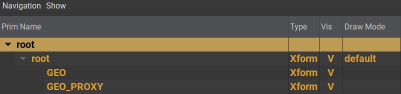
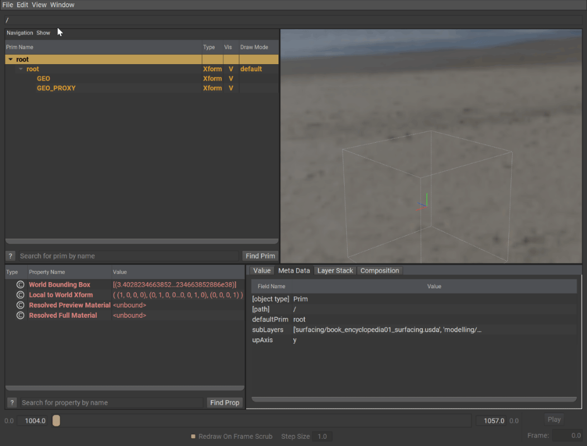
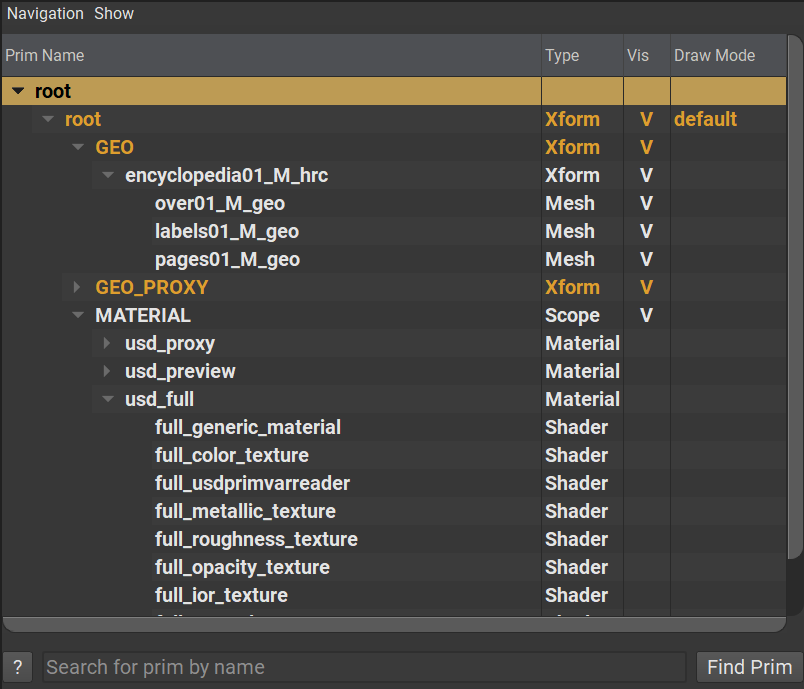

# Payload

Payloads are lazily loaded references. When a prim uses a payload, USD can be told to opt out of loading these layers unless the user requests to do so.  

When a referenced layer is heavy due to the amount of data or hierarchy complexity, it is often beneficial to have the user manually load those in after opening the layer in a stage. Generally speaking, non-important layers should be behind payloads. If they're not loaded, they also cannot be traversed and should not contain anything considered "important".  
The definition of "important" depends entirely on the use case of course.

## Example → Putting a high res model behind a payload

With unloaded payloads, the resulting hierarchy looks like this  
```admonish example title="Unloaded Payload"

```

However, the payload can be toggled on/off after the stage has been loaded.  

```admonish example title="Payload Toggle On/Off"

```

As a result, the full hierarchy is loaded

```admonish example title="Loaded Payload"

```

~~~admonish example title="simple_payload_example.usd" collapsible=true
```
#usda 1.0
(
    defaultPrim = "Asset"
)
 
def Scope "Asset"
{
    def Xform "Geometry"
    (
        prepend payload=@./highres_model.usd@
    )
    {
        float3[] extentsHint = [(-50, 0, -30), (50, 200, 30)]
    }
}
```
~~~

---

```admonish note title=""
↪ [USD Glossary - Payload](https://graphics.pixar.com/usd/release/glossary.html#usdglossary-payload)
```