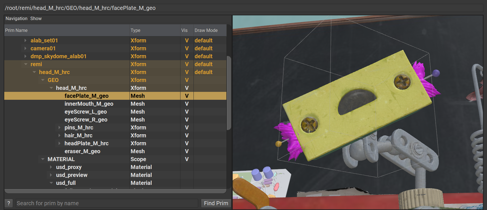

# Prims

Short for _Primitive_, and a quintessential component of USD.  
Prims are the nodes within a hierarchy and can thus have parent/child relationships with other prims; meaning that prims can have other prims as children or siblings, or have another prim as a parent.

In the image below, every node in the hierarchy is a prim.  
```admonish example title="Prim Example"

```

The keen-eyed will notice that prims can have a _type_. `Xform`, `Mesh`, `Scope` and `Material` are specific prim types.
These types come with default behavior and "data", the mechanism of which is explained in a later chapter.

```admonish info title=""
Users are also able to define their own Prim types
```

While Prims themselves indicate what "type" of scene element they are, they do not necessarily possess data themselves. However, they can be considered "containers" for named data, this data is generally expressed as [Properties](./properties.md).

---

```admonish note title=""
↪ [USD Glossary - Prim](https://graphics.pixar.com/usd/release/glossary.html#usdglossary-prim)
```
