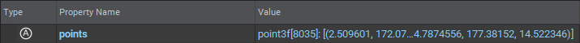
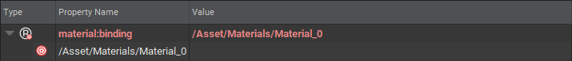

# Properties

[Prims](./prims.md) can have Properties, which are essentially named and typed data. 

A `Property` within USD is actually a collective term for two distinct types of Properties:

```admonish abstract title="Attributes"
Attributes are Properties with direct values that may vary over time  

```

```admonish abstract title="Relationships"
Relationships are Properties that point to other properties or [Prims](./prims.md)

```

In the above, you can see that properties are made up from a `name` and a typed `value`

These property names can also be namespaced. A property name can have 1 or more namespace identifiers separated by `:`.  
Looking closer at the relationship example, the property name `material:binding` is actually namespaced. The property's name itself is `binding` and it is part of a `material` namespace.

Namespaces can be used to categorize or group properties together.

---

```admonish note title=""
↪ [USD Glossary - Property](https://graphics.pixar.com/usd/release/glossary)
```