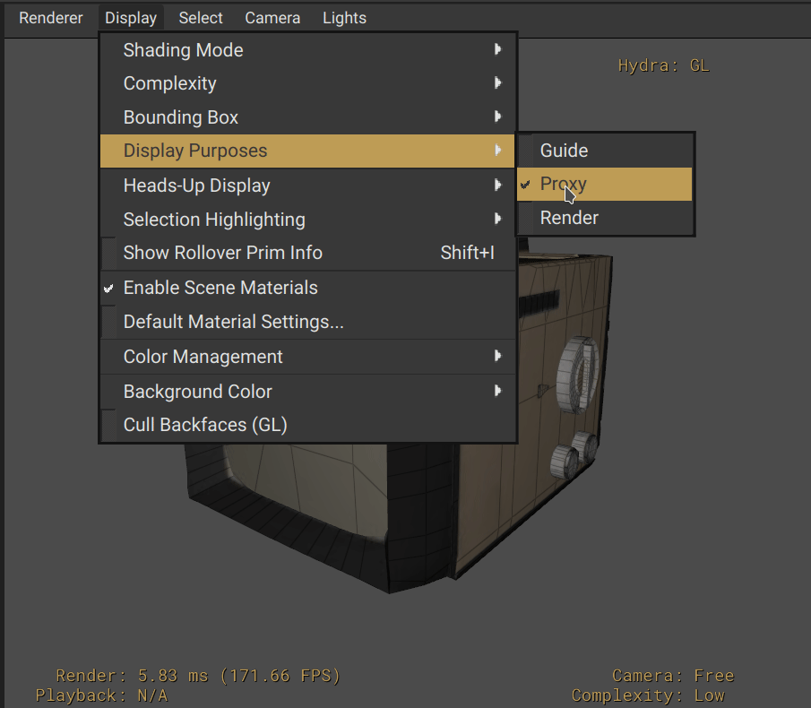
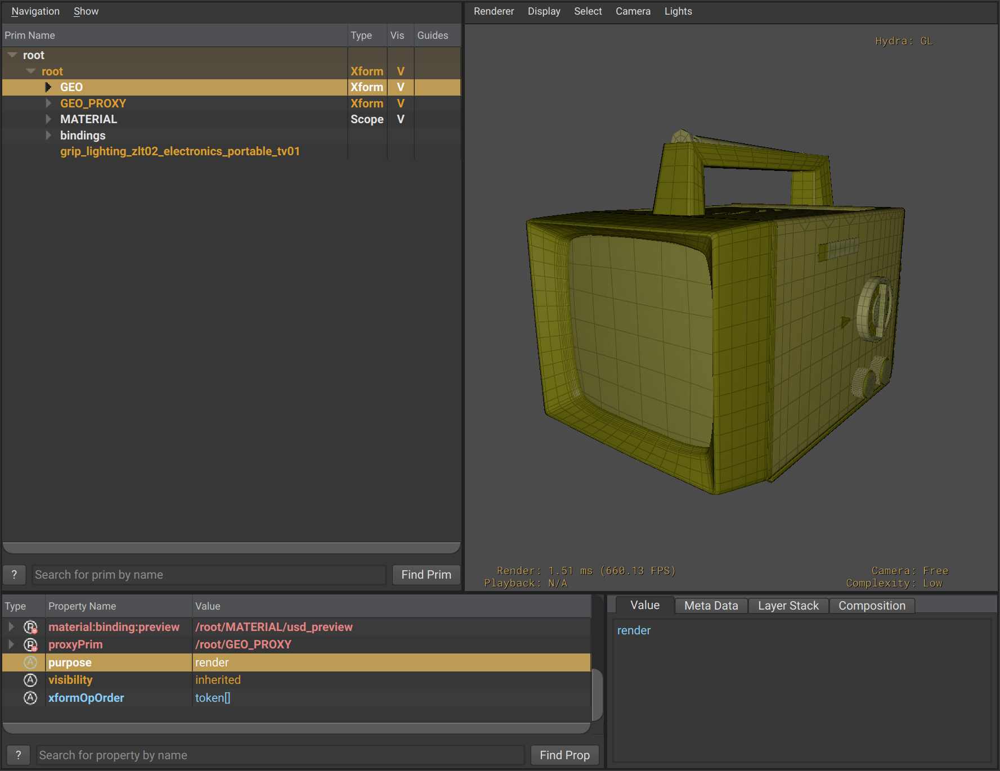
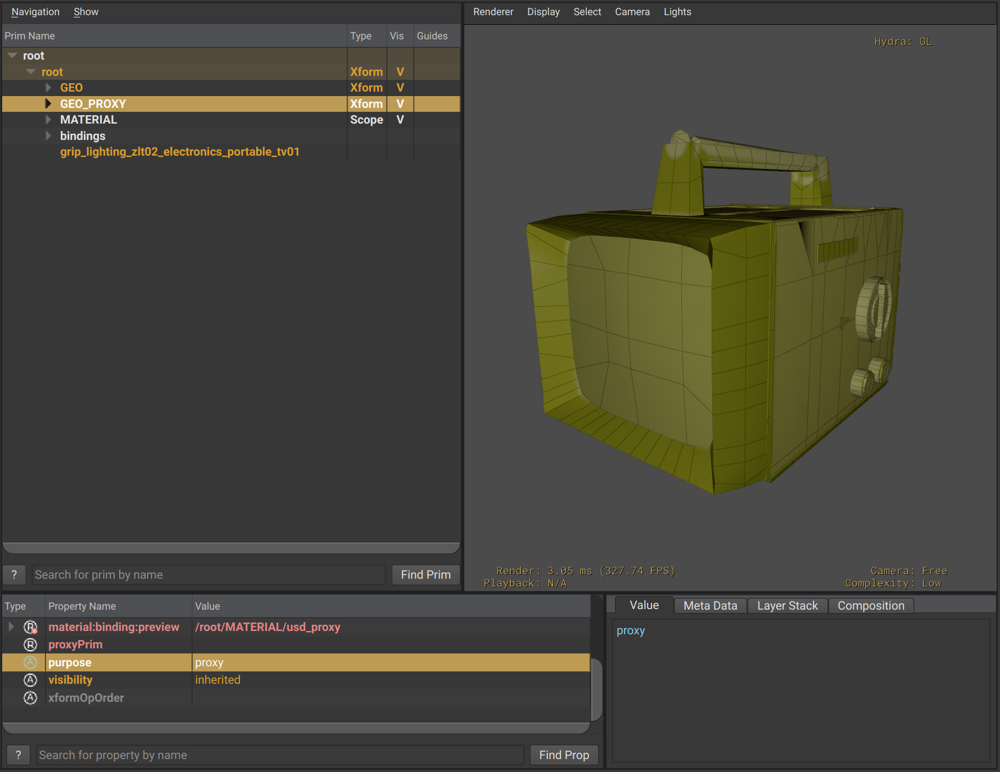

# Purpose


_Purpose_ is an attribute that can be used to give a prim and its descendants high-level "purpose" in terms of rendering. If a prim has its `purpose` attribute set to `render`, it will be excluded from being drawn in the viewport unless requested by the user.

In some sense, setting purpose could be considered [Stage Traversal](./stage_traversal.md) but for a renderer.


Currently, only 4 values are supported by the `purpose` attribute:

| Purpose    | Description | 
|--------------|-----------|
| `default` | The prim has no special rendering purpose and it will be included in all rendering traversals      |
| `guide`      | A prim tree marked with `guide` is generally used by interactive applications that have asked to "show guides". Think of it as requesting to controller geometry for rigs, skeleton data, etc  |
| `proxy`      | Proxy is usually reserved for a lightweight representation of another object to be used in an interactive renderer such as a DCC viewport  |
| `render`      | The "final quality" data to be imaged. Usually enabled for offline rendering, path tracing, etc  |


The example below toggles between "proxy" and "render" purposes in the viewport's Display settings.

```admonish example title="Example Switching between proxy and render Purposes"

```

When enabling `proxy` all prims and their subsequent hierarchies that have their purpose set to `proxy` will then be drawn by the viewport's renderer. This holds true for `render` too.

```admonish example title="Render Purpose"

```

```admonish example title="Proxy Purpose"

```

```admonish note title=""
Purpose for a viewport is not an exclusive toggle, it is possible to have both `proxy` _and_ `render` prim hierarchies active
```


---

```admonish note title=""
↪ [USD Glossary - Purpose](https://graphics.pixar.com/usd/release/glossary.html#usdglossary-purpose)
```
