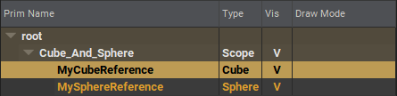
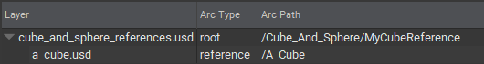
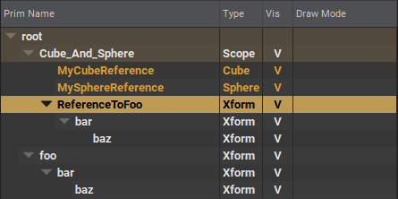
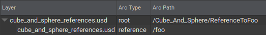
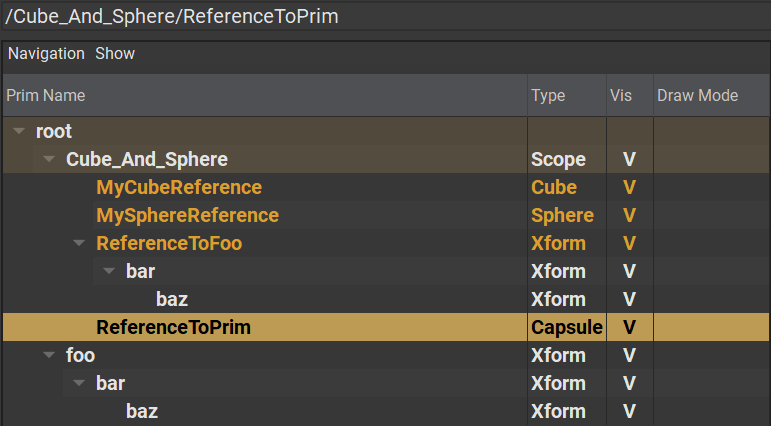
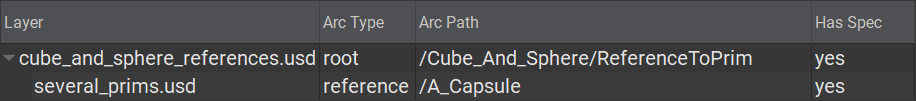

# Reference

## Layer References
Beyond sublayers, layers can also be grafted underneath prims. Using the example Cube and Sphere from [Local/Sublayer](./local_sublayer.md), we can also create prims and have them point to a these layers respectively.

```admonish example title="Layer referencing"


```

## Local References
While the general use-case is to use layers when referencing, it is not required to do so. It is entirely possible to add a reference to a prim within the same layer. This is known as a local reference

```admonish example title="Local referencing"


```

You would merely need to add a reference to the target prim and its entire hierarchy will be grafted underneath:

```
def "ReferenceToFoo"(
        prepend references=</foo>
) {
}
```

# Layer Prim References
But, this goes even further! Remember, composition acts on layer stacks, not individual layers; so it is also possible to reference specific prims from another layer's layer stack. Even if these prims themselves are the composed result from the target layer's layer stack

```admonish example title="Layer Prim referencing"


```

```
def "ReferenceToPrim"(
    prepend references= @./several_prims.usd@</A_Capsule>
) {
    float3 xformOp:translate = (3, 0, 0)
    uniform token[] xformOpOrder = ["xformOp:translate"]
}
```

---

```admonish note title=""
↪ [USD Glossary - Reference](https://graphics.pixar.com/usd/release/glossary.html#usdglossary-reference)
```