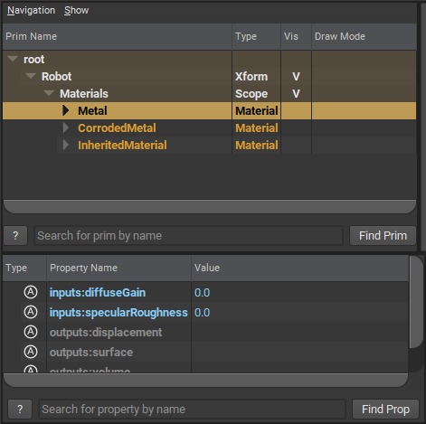
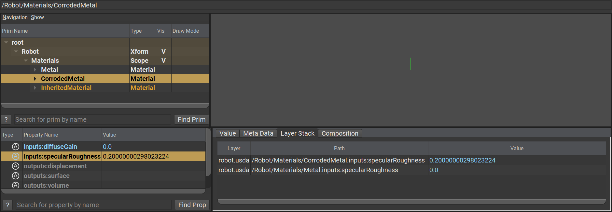
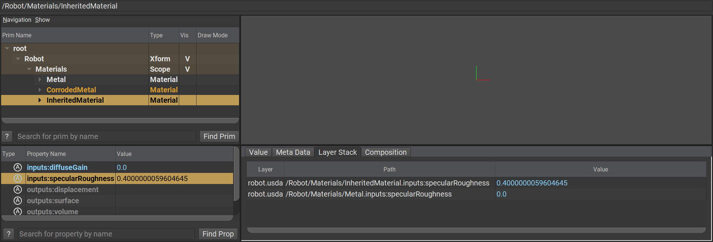
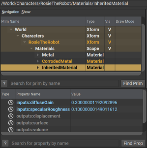
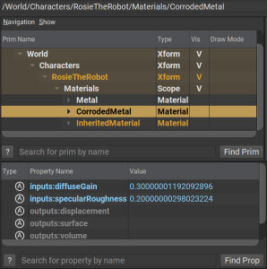

# Specializes
Specializing is taking a base definition of a prim (and its hierarchy) and further refining it into a specialized version of itself. For example taking a Metal material and specializing certain properties to make a CorrodedMetal material. This specialization could refine certain material properties, redefine or add shaders, textures, etc... It is not dissimilar from inherits, however with one key difference.

```admonish failure title=""
_Opinions expressed as specializations always win_\
```

If you try to express an opinion on a specialized property, your opinion will essentially be discarded. This is not the case however with [inherits](./inherits.md).

```admonish warning title=""
You cannot specialize an ancestor or descendant of a prim. Only siblings or prims outside of the Specialization's definition are allowed
```


## Example → Corroded Material specialization

There are two layers, `robot.usd` and `world.usd`. 

### Robot.usd
`robot.usd` defines a `Robot` prim and three Material prims, `Metal`, `CorrodedMetal` and `InheritedMetal`. `Metal` defines two attributes, `inputs:diffuseGain` and `inputs:specularRoughness`.

```admonish example title="robot.usd"

```

`CorrodedMetal` is a specialization of `Metal` where `inputs:specularRoughness` is the specialized attribute, we say it always has a value of `0.2`.

```admonish example title="specialized metal"
 
```

```
def Material "CorrodedMetal" (
    specializes = </Robot/Materials/Metal>
)
{
    # specialize roughness...
    float inputs:specularRoughness = 0.2
}
```

Whereas `InheritedMetal` is merely an inherits arc to `Metal` . You will notice that regardless of `inherits` or `specializes`, the result is the same. Both `CorrodedMetal` and `InheritedMetal` take over the base properties of `Metal`, but have an opinion on the `inputs:specularRoughness` attribute.

```admonish example title="inherited metal" 

```

### world.usd

`world.usda` references `robot.usda` and expresses and opinion on the base `Metal` prim. It says that `inputs:diffuseGain` and `inputs:specularRoughness` are to be 0.3 and 0.1 respectively.
 
~~~admonish example title="world.usd"
```
#usda 1.0
 
def Xform "World"
{
    def "RosieTheRobot" (
        references = @./robot.usda@</Robot>
    )
    {
        over "Materials"
        {
            over "Metal"
            {
                    float inputs:diffuseGain = 0.3
                    float inputs:specularRoughness = 0.1
            }
        }
    }
}
```
~~~

### Difference between `Inherits` and `Specializes`
When inspecting the resolved opinions in `world.usd`, notice that the overridden values for `inputs:diffuseGain` and `inputs:specularRoughness` on the base `Metal` propagate fully to `InheritedMaterial`, but not to our specialized `CorrodedMaterial`.

| Base Metal Override         | Result on `InheritedMaterial`     | Result on `CorrodedMaterial` |
|--------------|-----------|------------|
| <pre>over "Metal"</br>{</br>&nbsp;&nbsp;&nbsp;&nbsp;float inputs:diffuseGain = 0.3</br>&nbsp;&nbsp;&nbsp;&nbsp;float inputs:specularRoughness = 0.1</br>}</pre> |        |          |

As seen above, even when we have a stronger opinion on the base `Metal` definition for both properties, _specializations always win_.

---

```admonish note title=""
↪ [USD Glossary - Specializes](https://graphics.pixar.com/usd/release/glossary.html#usdglossary-specializes)
```