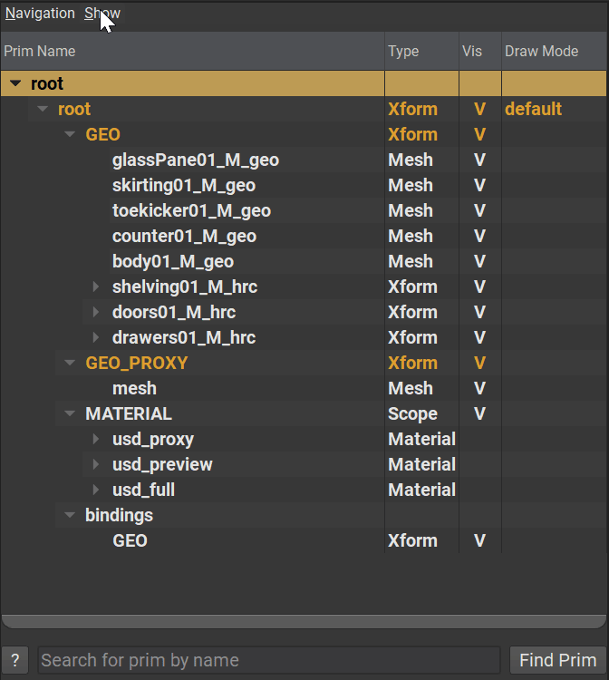

# Stage Traversal

Generally a concept used when programming with USD, but it is important to understand for users too. Stage Traversal is essentially iterating over the scene graph of a layer opened in a stage. Traversal can be filtered via "rules" (or predicates), limited to sub-trees, parts of the hierarchy can be pruned during traversal, and so on.

By default, USD Stage Traversal will only consider prims that are active, defined, loaded and are not abstract. Depending on which tool is used, users may be able to change this behavior. Using the programming interface however, developers have full control over this behavior.

```admonish example title="Toggling Abstract prims in USDView"


The prim `_root_type` is defined as a `class`, which is considered _abstract_ in USD. When opening the layer it is part of in USDView, it will not be shown in the hierarchy.  
However, enabling `Abstract Prims (Classes)` in the `Show` menu of the hierarchy view, any abstract prims like `_root_type` will then be displayed in the hierarchy. Internally, this is modifying the Stage Traversal predicate.
```

---

```admonish note title=""
↪ [USD Glossary - Stage Traversal](https://graphics.pixar.com/usd/release/glossary.html#usdglossary-stage-traversal)
```