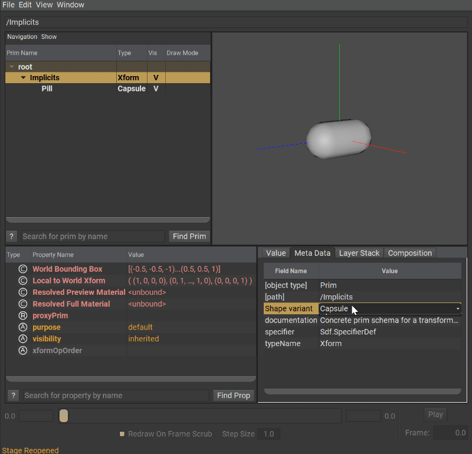

# VariantSet

VariantSets and variants allow for authoring a "switchable" state of a prim within a layer. In the example below, a top level prim with the name `Implicits` is authored which defines a VariantSet named `Shape`. This VariantSet defines a few different entries (aka variants ) that each do something different.

When changing the active variant, USD will inject anything that is defined within that variant into the current composition. In our example, each variant adds a child to `Implicits` with differing types. One is a capsule, another a cube, a sphere, and so on.

```admonish example title="Variant/VariantSet example"
  
```

Within variant definitions, you are essentially free to do whatever you want. If you wish to define a complete hierarchy in a variant, you can. Add references to other layers? You can. Expressing opinions on values or metadata, you can. However.

```admonish warning title=""
There can only ever be one Variant active at a time for a VariantSet.
```

---

```admonish note title=""
↪ [USD Glossary - VariantSet](https://graphics.pixar.com/usd/release/glossary.html#usdglossary-VariantSet)  
↪ [USD Glossary - Variant](https://graphics.pixar.com/usd/release/glossary.html#usdglossary-Variant)
```