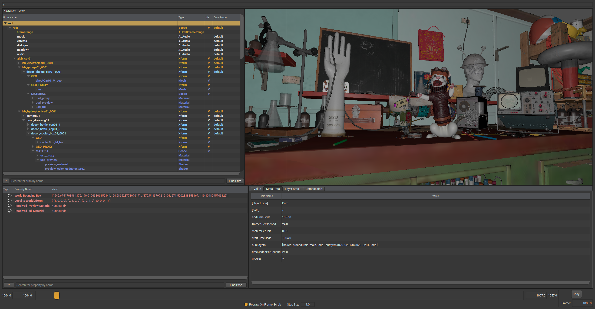
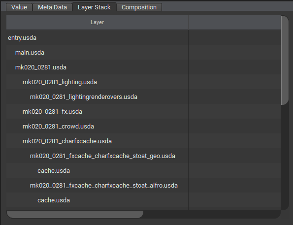

# So, what even is  USD?

In short, USD is a way to describe 3D-Scene Hierarchies.

```admonish example title="Example USD Scene"

<sub>[Animal Logic ALab](https://animallogic.com/alab/) USD Scene, inside USDView</sub>
```

Generally speaking, hierarchies consist of entries (aka. `nodes`) that have parent/child/sibling relationships with other nodes.  
In USD, these nodes can have "physicality" (think of Geometry, Animation data, etc...) or be more abstract like grouping items, materials, shaders, and even "settings" can be expressed as a node within a hierarchy.  

Where USD differs greatly from other scene descriptions, is in its ability to combine hierarchies together with varying types of behavior (this is known as [composition](./basic/composition.md)). Within USD you can non-destructively refer to- or graft other hierarchies together, re-define previously defined data, collaborate with many others on the same hierarchy, and much more.

```admonish example title="Example USD Scene Composition"
  
<sub>Part of the list of USD scenes that make up the composition of [Animal Logic ALab](https://animallogic.com/alab/) USD Scene, inside USDView</sub>
```

## But wait! There's more!

Beyond non-destructively combining hierarchies, USD is built to be extensible.  
For instance, extending USD with a plugin that can parse a bespoke or commercially available file format and use those files directly inside USD. 

```admonish note title=""
A concrete example would be to support using FBX files directly inside a USD hierarchy
```

All in all, USD aims to be a portable interchange format by defining a shared "language" sort to speak to describe scene and 3D data.  
This idea is not new, but USD takes this a step further by also offering a way to consistenly draw/render/image scenes. This is made possible through `Hydra`, USD's backend rendering technology.

```admonish warning title=""
This book does not currently cover Hydra concepts, but may do so in the future
```
